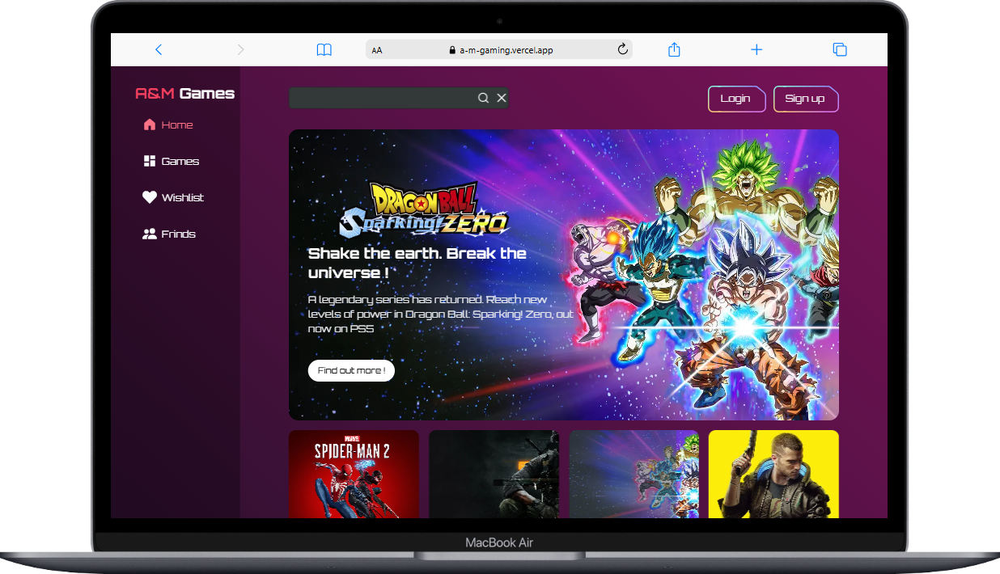
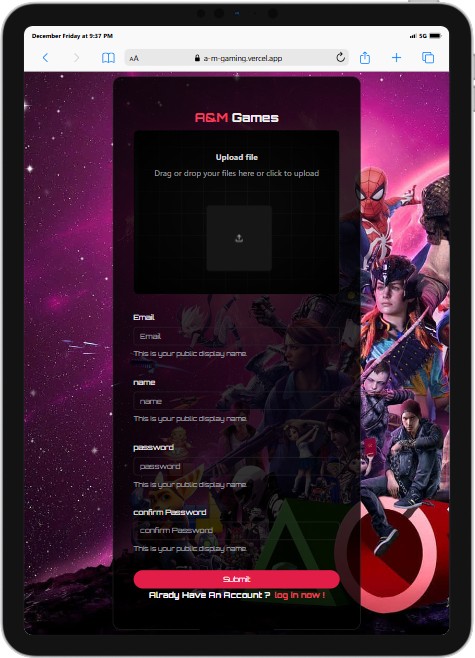

# AM Gaming

Welcome to the **AM Gaming** repository! 🎮 Dive into the details of our gaming platform, built to provide an exceptional experience for gamers worldwide.

## 🚀 Features

- Stunning design and animations for immersive user experience.
- Advanced state management and data fetching.
- Validation of forms and data schemas.
- Fully responsive and user-friendly interface.

---

## 🌟 Technologies Used

Below is a list of the technologies and libraries used in this project, along with their colored logos:

| Technology        | Description                                  | Logo                                                                 |
|--------------------|----------------------------------------------|----------------------------------------------------------------------|
| **TypeScript**    | Typed JavaScript at any scale.               |  |
| **Next.js**       | The React framework for production.          |       |
| **React**         | A JavaScript library for building UIs.       |            |
| **MongoDB**       | A document-based, distributed database.      |         |
| **Tailwind CSS**  | A utility-first CSS framework.               |  |

---

## 📸 Screenshots

Here are some snapshots of the website:


*The homepage of AM Gaming.*


*The signup page.*

---

## 📂 Project Setup

To run this project locally:

1. Clone the repository:

   ```bash
   git clone https://github.com/yourusername/am-gaming.git
   ```

2. Install dependencies:

   ```bash
   npm install
   ```

3. Run the development server:

   ```bash
   npm run dev
   ```

4. Open your browser at `http://localhost:3000`.

---

## 🤝 Contributions

We welcome contributions! Please fork the repository and submit a pull request.

